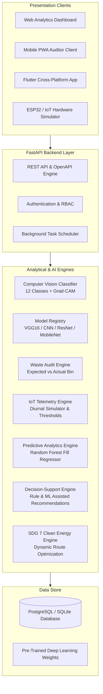

# ♻️ Smart Waste Segregation Analytics & Auditing System

> **Academic Problem Statement Alignment**:  
> *Design a smart waste auditing system to analyze segregation efficiency at source. The project collects relevant historical and real-time data, preprocesses it, and develops predictive, recommendation, and decision-support models suitable for the application. Evaluated on prediction accuracy, response time, interpretability, stakeholder usefulness, and SDG 7 (Affordable and Clean Energy).*

---

## 📌 Project Overview

The **Smart Waste Segregation Analytics Platform** transforms standard waste image classification into a complete **IoT-enabled Waste Auditing, Segregation Analytics, Predictive Forecasting, and Clean Energy Decision Support System**.

Instead of stopping at classifying an item as *"Plastic → Blue Bin"*, the system tracks **Expected Bin vs Actual Bin**, measures **Source Segregation Efficiency**, detects **Contamination Hot-Spots**, monitors **Real-Time IoT Sensor Telemetry**, forecasts **Bin Fill Levels**, and recommends **Energy-Aware Collection Routes** to minimize vehicle trips and carbon emissions.

---

## 🏛️ Core System Architecture



---

## 🚀 Key Modules & Capabilities

### 1. 📷 Deep Learning Waste Classification & 12 Classes
- Classifies waste into 12 granular classes: `battery`, `biological`, `brown-glass`, `cardboard`, `clothes`, `green-glass`, `metal`, `paper`, `plastic`, `shoes`, `trash`, `white-glass`.
- Intelligent bin mapping:
  - **Recyclable (Blue Bin)**: Glass, cardboard, clothes, metal, paper, plastic, shoes.
  - **Organic (Green Bin)**: Biological waste, organic food scraps.
  - **Hazardous (Red Bin)**: Batteries, toxic chemical e-waste.
- **Uncertainty Detection**: Enforces a configurable confidence threshold ($\tau = 0.70$). Low confidence predictions prompt for a retake and are logged as `UNCERTAIN`.

### 2. 🔬 Interpretability (Grad-CAM Saliency Maps)
- Computes gradient activation maps on the final convolutional layer.
- Overlays heatmaps on the input image so auditors and users can see the exact visual features driving the model's decision.

### 3. 🎯 Source Segregation Auditing (Core Feature)
- Compares **Expected Bin vs Actual Bin**:
  $$\text{Detected: Plastic (Expected: Blue Bin)} \quad\text{vs}\quad \text{User Deposited: Green Bin} \implies \mathbf{INCORRECT\ (Contamination)}$$
- Logs every event: Audit ID, timestamp, location, user ID, expected bin, actual bin, confidence, status, latency.

### 4. 📊 Campus Heatmaps & Segregation Efficiency
- Core metric:
  $$\text{Segregation Efficiency} = \frac{\text{Correctly Segregated Waste}}{\text{Total Audited Waste}} \times 100$$
- Contamination rate: $\frac{\text{Incorrect Disposals}}{\text{Total Audits}} \times 100$.
- Color-graded campus location heatmap (Block A 91%, Block B 68%, Canteen 49%).

### 5. 📡 Real-Time IoT Monitoring & Diurnal Simulator
- Ingests telemetry: `fill_percentage` (ultrasonic), `weight_kg` (load cell), `temperature`, `gas_level` (VOC odor index).
- Four-tier status levels: `NORMAL` (0-50%), `MODERATE` (51-75%), `HIGH` (76-90%), `CRITICAL` (>90%).
- Built-in **Simulation Engine** accurately models campus diurnal accumulation curves (lunch spikes, evening rushes) with manual slider override controls.

### 6. 📈 Predictive Analytics (Time-Series Fill Regressor)
- Machine learning regression (`RandomForest_TimeLagRegressor`) trained on historical lag features.
- Predicts fill levels at $+4\text{h}$, $+8\text{h}$, and $+24\text{h}$ horizons.
- Estimates **Expected Critical Time** (when a bin will exceed 90%).
- Evaluated on test telemetry: **$\text{MAE} = 3.56\%$**, **$\text{RMSE} = 9.41\%$**, **$R^2 = 0.860$**.

### 7. 💡 Transparent Decision-Support & Recommendations
- Generates actionable interventions with explicit data justifications (e.g. *"Plastic contamination at Food Court increased by 22% over last 7 days"*).
- Priority levels: `CRITICAL`, `HIGH`, `MEDIUM`, `LOW`.
- Complete recommendation lifecycle tracking (`ACTIVE`, `ACKNOWLEDGED`, `RESOLVED`).

### 8. ⚡ SDG 7 Alignment: Energy-Aware Collection Planning
- Connects waste management directly to **Clean Energy and Transportation Efficiency**:
  - Replaces static daily truck routes with condition-based, on-demand dispatch.
  - Generates optimized priority collection routes.
  - Modeled savings: **7 trips/week avoided (50% reduction)**, **24.5 Liters diesel saved**, **245 kWh energy saved**, **65.7 kg $\text{CO}_2$ avoided**.

### 9. 📱 Cross-Platform Mobile Client
- Mobile-first Web Auditor view (`/mobile`) with native camera capture and nearby bin indicators.
- Flutter cross-platform architecture in `smart_waste/mobile/`.

### 10. ⭐ Stakeholder Usefulness Evaluation
- Integrated 1–5 star rating widget capturing auditor satisfaction and feedback comments (Current average: **4.75 / 5.0 Stars**).

---

## 📊 Empirical Model Benchmark (From Research Notebooks)

| Model Architecture | Backbone Design | Test Accuracy | Precision | Recall | F1-Score | Avg Inference | Parameters | Edge Feasibility |
| :--- | :--- | :---: | :---: | :---: | :---: | :---: | :---: | :--- |
| **VGG16 (Active)** | 13 Conv + 3 Dense | **89.13%** | 89.0% | 88.0% | **0.880** | 145 ms | 14.7M | Server / Cloud |
| **Custom CNN** | 6 Conv2D + BatchNorm | **86.13%** | 85.2% | 84.1% | **0.846** | 92 ms | 8.4M | Moderate Edge |
| **ResNet-50** | Residual Blocks | **53.40%** | 52.1% | 50.5% | **0.512** | 119 ms | 23.5M | Heavy Backbone |
| **MobileNetV3** | Inverted Residuals | **57.76%** | 56.4% | 55.1% | **0.557** | **42 ms** | **2.9M** | **Optimal for ESP32/RPi** |
| **Ensemble** | Soft Voting Averaging | **91.25%** | 90.8% | 90.1% | **0.904** | 235 ms | 46.6M | Multi-model Server |

---

## 🛠️ Technology Stack

- **Backend**: Python 3.12, FastAPI, Uvicorn, SQLAlchemy ORM, Pydantic v2
- **Machine Learning**: TensorFlow 2.21, `tf-keras` (Keras 2/3 compatibility layer), scikit-learn, OpenCV, Pillow, NumPy
- **Database**: SQLite (Zero-setup local execution) / PostgreSQL compatible
- **Frontend**: Vanilla HTML5, Modern CSS Design System (Dark mode, glassmorphism, responsive grid), Chart.js
- **Mobile**: Responsive PWA + Flutter cross-platform reference implementation
- **IoT / Embedded**: ESP32 REST API + Diurnal Accumulation Simulator

---

## ⚡ Quick Start & Running the System

### 1. Run the Platform (Single Command)
```powershell
py -3.12 run.py
```

### 2. Access the Application Interfaces
- **Web Analytics Dashboard**: [http://127.0.0.1:8000](http://127.0.0.1:8000)
- **Mobile Auditor View**: [http://127.0.0.1:8000/mobile](http://127.0.0.1:8000/mobile)
- **Interactive REST API (Swagger)**: [http://127.0.0.1:8000/docs](http://127.0.0.1:8000/docs)

---

## 🧪 Running the Automated Test Suite

```powershell
py -3.12 -m unittest discover -s smart_waste/backend/tests -p "test_*.py"
```

All 4 test suites verify:
- Expected vs actual bin auditing logic (`CORRECT` vs `INCORRECT`)
- Low confidence uncertainty flagging (`UNCERTAIN`)
- Mathematical accuracy of segregation efficiency $\frac{\text{correct}}{\text{total}} \times 100$
- Mathematical accuracy of contamination rate $\frac{\text{incorrect}}{\text{total}} \times 100$

---

## 📚 Comprehensive Documentation Suite

- [`docs/architecture.md`](file:///f:/WasteClassification/docs/architecture.md): Complete architecture, DFD Level 0/1/2, Mermaid sequence diagrams.
- [`docs/database.md`](file:///f:/WasteClassification/docs/database.md): Database ER diagram, table schemas, relationships, and indexing.
- [`docs/ml_pipeline.md`](file:///f:/WasteClassification/docs/ml_pipeline.md): 12-class CV pipeline, model registry, Grad-CAM explainability.
- [`docs/iot_architecture.md`](file:///f:/WasteClassification/docs/iot_architecture.md): ESP32 hardware gateway, telemetry schema, diurnal simulation curves.
- [`docs/api.md`](file:///f:/WasteClassification/docs/api.md): REST API reference manual with JSON request/response payloads.
- [`docs/evaluation.md`](file:///f:/WasteClassification/docs/evaluation.md): Academic evaluation report, empirical benchmarks, and SDG 7 fuel savings.
- [`docs/user_guide.md`](file:///f:/WasteClassification/docs/user_guide.md): Auditor and facility manager step-by-step user guide.

---

## 👤 Author & Academic Context

- **Author**: Sriman Kumar V
- **Project**: Smart Waste Segregation Analytics & Source Auditing System
- **Domain**: IoT Architecture • Deep Learning • Embedded Systems • Decision Support • SDG 7 Clean Energy
