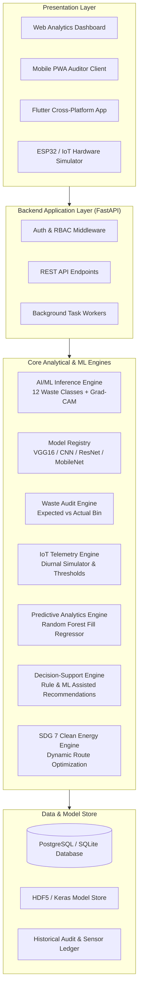
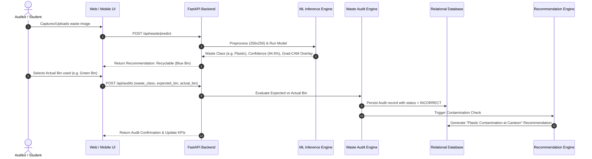
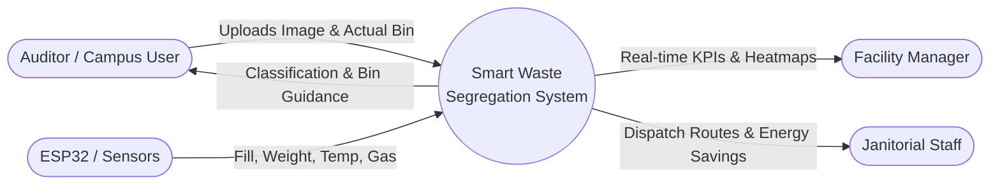

# System Architecture — Smart Waste Segregation Analytics

## 1. High-Level System Architecture

The Smart Waste Segregation Analytics System transforms point-in-time waste classification into an end-to-end audit, IoT telemetry, and decision-support platform.

---

## 2. Multi-Module Processing Pipeline

---

## 3. Data Flow Diagrams (DFD)

### Level 0 DFD (Context Diagram)

### Level 1 DFD (Subsystem Interaction)
1. **P1.0 Image Ingestion & Preprocessing**: Validates format, resizes to $256 \times 256$, normalizes pixel values to $[0, 1]$.
2. **P2.0 Neural Inference & Saliency**: Generates class probabilities, applies confidence threshold ($0.70$), produces Grad-CAM heatmap.
3. **P3.0 Waste Auditing**: Maps predicted class to expected dustbin; verifies against physical bin used; labels status `CORRECT`, `INCORRECT`, or `UNCERTAIN`.
4. **P4.0 IoT Telemetry Processing**: Records fill %, load cell weight (kg), temperature (°C), gas (ppm); classifies status `NORMAL`, `MODERATE`, `HIGH`, `CRITICAL`.
5. **P5.0 Predictive Forecasting**: Runs Random Forest regression on temporal lag features to predict $+4h$, $+8h$, and $+24h$ fill levels.
6. **P6.0 Decision Support & SDG 7 Optimization**: Generates prioritized recommendations and computes vehicle fuel savings from demand-based routing.

---

## 4. SDG 7 — Affordable and Clean Energy Alignment

Traditional municipal waste collection runs on fixed daily schedules where trucks visit every bin regardless of fill level.
The system implements **Energy-Aware Collection Planning**:
- **Condition-Based Servicing**: Trucks are dispatched only to bins that are `HIGH` ($>75\%$) or predicted to hit `CRITICAL` ($>90\%$) before the next cycle.
- **Trip Reduction Modeling**:
  $$\text{Modeled Fuel Saved (L)} = \text{Trips Avoided} \times \text{Avg Trip Distance (km)} \times 0.28\text{ L/km}$$
  $$\text{Energy Equivalent (kWh)} = \text{Fuel Saved (L)} \times 10\text{ kWh/L}$$
  $$\text{Modeled }\text{CO}_2\text{ Reduction (kg)} = \text{Fuel Saved (L)} \times 2.68\text{ kg CO}_2\text{/L}$$
