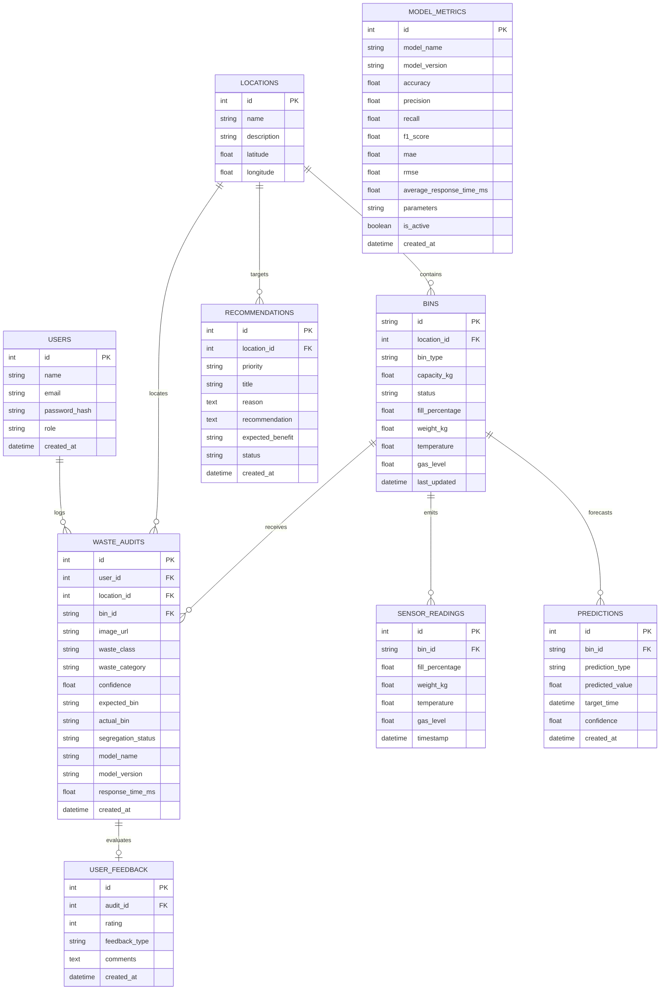

# Database Architecture & Schema Specification

## 1. Entity-Relationship (ER) Diagram

---

## 2. Table Specifications & Integrity Constraints

### `waste_audits`
- **Purpose**: Primary audit ledger tracking every verified waste disposal.
- **`segregation_status`**: Enforces tripartite categorization:
  - `CORRECT`: User placed item into the correct dustbin.
  - `INCORRECT`: Contamination occurred (e.g. plastic deposited in green bin).
  - `UNCERTAIN`: Image model confidence fell below threshold ($< 0.70$).
- **Indexes**: Indexed on `created_at` (for rolling window queries) and `location_id` (for campus heatmaps).

### `sensor_readings`
- **Purpose**: High-frequency telemetry log from ultrasonic fill sensors, load cells, temperature probes, and gas sensors.
- **Indexes**: Indexed on `bin_id` and `timestamp`.

### `model_metrics`
- **Purpose**: Academic audit log storing measured test accuracy, F1, latency, and parameter count for every registered deep learning architecture.
